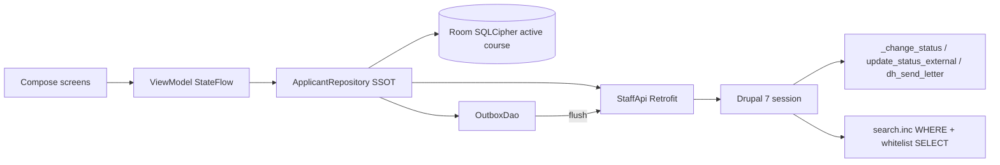

# DIPI Staff Android — Vertical 1 architecture

**Date:** 2026-08-13  
**Product:** Centre-staff client of `dh_manageapp` (Today’s applications only)  
**Status:** SUPERSEDED for implementation by `docs/DIPI-STAFF-IMPLEMENTATION-PROMPT-GROK-4.6.md` (2026-08-13).

**Overrides (do not follow the sections below where they conflict):**

- No access control / gender / tenancy logic in the app — server filters; render errors verbatim.
- No `/staff` status façade — call `/change-status/{id}?s=&l=&c=` directly (`l=0`).
- No attendance write in Vertical 1 (no `/staff/.../attended`).
- Server URL is `BuildConfig.BASE_URL` (fixed; debug Gradle override). Login has no URL field.
- Build screens in the design: photos, day summary, settings, audit panel.
- **2026-08-15:** Live host has no `/staff` and no Services login. The shipped client scrapes desk HTML (`LIVE-DESK-HAR.md`). The “Never parse HTML / mock `/staff` first” plan below is historical.

Keep this file only as historical context.

---

## 1. API strategy (hybrid — locked)

Do not reopen A/B/C.

| Need | How |
|---|---|
| Login / CSRF | Mirror Drupal Services: `POST /api/user/login` + cookie + `X-CSRF-Token` from `/services/session/token`. Android `StaffApi` can wrap the same shape on `/staff` later. |
| Who am I / what may I see | **New** `GET /staff/session` — user, permissions, `genderAccess`, centres from `dh_user_center`, `modeTest`. |
| Course list | **New** `GET /staff/centres/{cid}/courses?upcoming=1` — unfinalized rows. `TODO(server): dh_center + dh_course`. |
| Worklist + search | **New** `GET /staff/courses/{id}/applicants` — JSON projection of `search.inc` applicant query. **Do not parse `/search-app` HTML.** |
| Status write | **Reuse** `/change-status/{aId}?s=&l=&c=` **or** 1:1 façade `POST /staff/applicants/{aId}/status` that only calls `_change_status`. |
| Attended write | **Do not call `/app-update-attended` in v1.** That endpoint requires room section/number when `today <= c_start` and returns full Day-0 HTML-shaped lists. **New** thin façade `POST /staff/applicants/{aId}/attended` that only sets `dh_applicant.a_attended` (and does not invent letters/waitlist). |
| Status catalog | **New** `GET /staff/meta/statuses` from `dh_type_detail`. |

**Forbidden:** WebView, HTML scrape, APP API keys, `get-app-detail`, `/zeroday`, AT portal, letter-body preview.

If PHP cannot be written in the same session: Android implements `docs/openapi-staff.yaml` + MockWebServer. Every mock is tagged `TODO(server): <php function>`.

No new status transitions. No copy of `update_status_external()` or `dh_send_letter()` into Kotlin.

---

## 2. Domain model

Value types (inline classes / `@JvmInline`), not raw `Int`/`String` in feature code:

- `CentreId`, `CourseId`, `ApplicantId`, `ConfNo`
- `ApplicantStatus` — `value: String` from server; known literals as `enum` fallback (`Received`, `Clarification`, `ClarificationResponse`, `Confirmed`, `Expected`, `ReConfirmation`, `Attended`, `Left`, `Cancelled`, `Rejected`, `Errors`, `WaitList`, `Duplicate`, `Custom`, `Deceased`, plus LC chips)
- `Gender` (`M`/`F`) + `GenderAccess` (`male`, `female`, `both`, `none`)
- `ApplicantCard` — public `a_*` only (see OpenAPI). `ApplicantSensitive` exists in the model and **must stay unused** in v1
- `Course` — id, name, start, end, `finalized`, type key, optional gender open/full flags
- `Session` — user display name, permissions, genderAccess, centres, `modeTest`
- `OutboxOp` — `ChangeStatus` | `SetAttended`, payload, `pending`/`synced`/`conflict`

Status machine is **display + send**. Kotlin does not decide WaitList, conf-no mint, or LC approve. It shows `newStatus` / `confNo` from the server.

---

## 3. Screens (Vertical 1)

Adaptive (Navigation 3 `ListDetailSceneStrategy`): phone stacked, tablet two-pane at `width >= 600.dp`. No Day-0 / seating / AT IA.

```
Login (baseUrl, user, password)
  → Centre + course picker (skip picker if one centre + one upcoming course)
    → Today (status chips + counts + search + list)
         → Applicant card
              → Change-status sheet
    → Settings (base URL, test-mode banner, logout)
```

**Change-status sheet:** target status, optional comment, checkbox “send letter” (sends `letterId=0` unless we later list templates). Copy: *This may send a letter to the applicant.* No body preview.

**Today list:** filter chips = statuses present in the loaded page + All. Search `q` hits name, conf no, phone, email (server-side).

---

## 4. Data flow



- **Read:** stale-while-revalidate. Room is SSOT; refresh on course enter and pull-to-refresh.
- **Write:** optimistic local row + outbox. Flush when online. **Server wins** on conflict (re-fetch card, snackbar).
- Wipe Room + outbox on logout and on centre switch.
- No photos on disk. No `ae_*`, Aadhaar, PAN, passport, voter id in Room or logs.

---

## 5. Offline

- Cache **one** course worklist.
- Outbox: status + attended only.
- Banner when outbox non-empty or request failed (timeout / 403 / session expired → login).
- Session cookie in Encrypted DataStore. TLS required. `FLAG_SECURE` on applicant card.

---

## 6. Security and tenancy

- Every list/detail filtered on the server by `a_center` ∈ user’s `dh_user_center` and by `access male` / `access female`.
- Client still hides chips/actions the session says are missing (`change status`, gender).
- No writes if `course.finalized == true` (disable UI; server 409).
- Release builds: no real student fixtures. Mock data is synthetic.

**Public card whitelist** (new search API must project only these — desk `search.inc` currently SELECTs NPI):

`a_id`, `a_f_name`, `a_m_name`, `a_l_name`, `a_gender`, `a_status`, `a_type`, `a_old`, `a_attended`, `a_conf_no`, `a_email`, `a_phone_mobile`, `a_phone_home`, `a_city`/`cityName`, `a_state`, `a_country`, `a_dob`/`age`, `a_center`, `a_course`, `a_alist`, `a_monk`, `a_created`

---

## 7. Risks

| Risk | Mitigation |
|---|---|
| `/search-app` is HTML | New JSON only; never scrape |
| `/app-update-attended` needs rooms | Thin `a_attended` façade; Day-0 allotment stays Vertical 2 |
| `_change_status` + `s=Approved` is LC | Do not offer “Approved” in v1 picker; send desk literals only |
| Letter side effect | Confirm sheet copy; `letterId` default 0 |
| Gender leak | Server filter + client hide |
| Finalized course | Hide from picker; 409 on write |
| Drupal 7 session expiry | 401/403 → re-login; persist cookie encrypted |
| CSRF | Send `X-CSRF-Token` on POSTs |
| `search.inc` SELECT is NPI-heavy | Whitelist in façade |

---

## 8. Implementation sequence (max 6)

1. Gradle multi-module skeleton + `:core:model` types + OpenAPI models.  
   Verify: unit test `ApplicantStatus` fallback parse.
2. `:core:network` Retrofit + mock server for all v1 routes.  
   Verify: mock login → session → applicants fixture.
3. `:core:datastore` + `:core:database` (session, worklist, outbox).  
   Verify: wipe-on-logout test.
4. `:feature:auth` + course picker.  
   Verify: Compose test login → course list.
5. `:feature:applicants` Today list + card + search.  
   Verify: gender-hidden rows never bind; list keys by `ApplicantId`.
6. Status sheet + attended toggle + outbox flush.  
   Verify: unit tests for request mapping; UI test change Received → Confirmed shows `confNo` from mock.

---

## 9. What “done” means (Vertical 1)

Staff on phone or tablet can: log in (mock or real), see counts by status, search, change status and see `newStatus`/`confNo`, toggle `a_attended`, never see other gender / other centre / `ae_*`.

Out of this phase: Day-0 lists, seating, CameraX, letter admin, add/edit form, AT, finalize.
